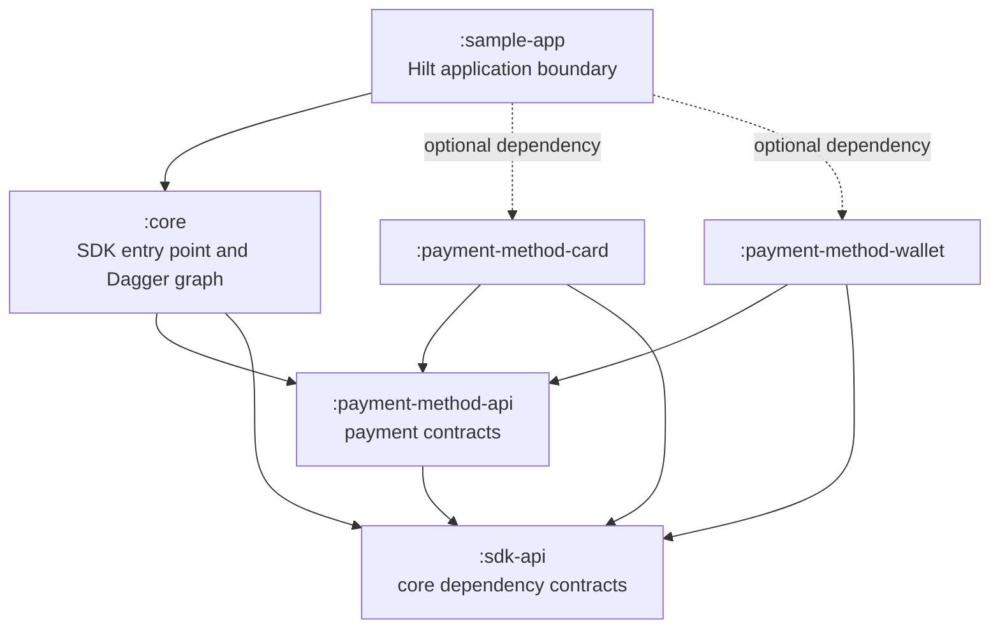
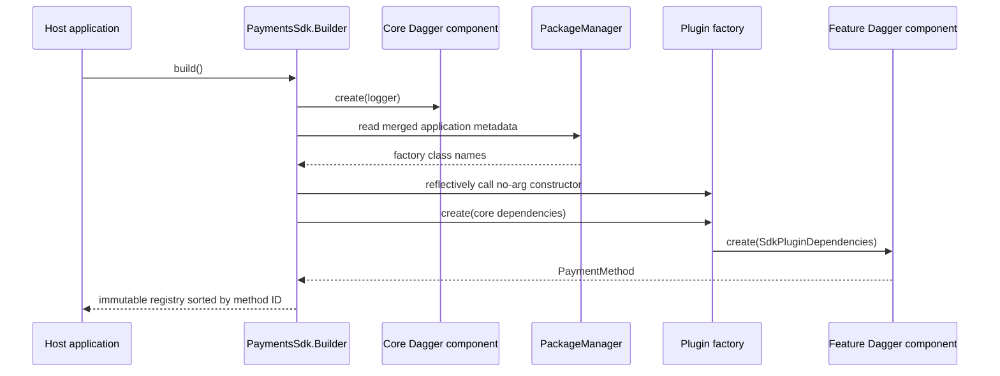

# Payments SDK Plugin Architecture

A multi-module Android SDK sample where optional payment-method AARs register
themselves through merged manifest metadata. The host app chooses capabilities
only by adding dependencies; it does not write registration code.

This project demonstrates architecture and discovery. It does not send network
requests, persist payment state, or handle sensitive card data.

## Module graph



| Module | Artifact | Responsibility |
| --- | --- | --- |
| `sdk-api` | `io.mz.payments:sdk-api` | Logging and the narrow dependency surface exposed to plugins |
| `payment-method-api` | `io.mz.payments:payment-method-api` | Money, request/result, method, and factory contracts |
| `core` | `io.mz.payments:core` | Builder, manifest discovery, registry, dispatch, and core Dagger component |
| `payment-method-card` | `io.mz.payments:payment-method-card` | Independent card implementation and feature-owned Dagger component |
| `payment-method-wallet` | `io.mz.payments:payment-method-wallet` | Independent wallet implementation and feature-owned Dagger component |
| `sample-app` | App only | Compose UI and Hilt integration at the application boundary |

All SDK artifacts are Android libraries and publish release AARs with source
JARs. Only `sample-app` produces APKs and AABs. `core` exposes both contract
artifacts transitively.

## Runtime discovery

Each optional plugin contributes metadata from its AAR manifest:

```xml
<meta-data
    android:name="io.mz.payments.plugin.card"
    android:value="io.mz.payments.card.CardPaymentPluginFactory" />
```



The discovery object loads each factory once. Missing optional plugins are
valid. Malformed metadata, a class with the wrong contract, feature
initialization failures, and duplicate payment-method IDs fail SDK
initialization with descriptive exceptions.

The public factory classes use `@Keep`, and each plugin AAR also packages a
consumer R8 rule. KSP is used for Dagger and Hilt generation only. Discovery
does not require `ServiceLoader`, a custom KSP processor, or host registration.

## Consumer usage

Add the core artifact and only the desired payment methods:

```kotlin
dependencies {
    implementation("io.mz.payments:core:1.0.0-SNAPSHOT")
    implementation("io.mz.payments:payment-method-card:1.0.0-SNAPSHOT")
    // implementation("io.mz.payments:payment-method-wallet:1.0.0-SNAPSHOT")
}
```

Create an independent SDK instance with the application context:

```kotlin
val paymentsSdk = PaymentsSdk.builder(context)
    .logger(SdkLogger { message -> Log.d("PaymentsSdk", message) })
    .build()

val methods = paymentsSdk.availablePaymentMethods
```

The sample app provides this instance from a Hilt singleton module. SDK and
plugin modules use plain Dagger and have no dependency on Hilt.

## Sample flavors

| Flavor | Optional dependencies | Expected method IDs |
| --- | --- | --- |
| `base` | None | `[]` |
| `card` | Card | `[card]` |
| `wallet` | Wallet | `[wallet]` |
| `all` | Card and wallet | `[card, wallet]` |

The Compose screen lists the discovered methods and runs a deterministic EUR
12.50 sample payment. Monetary values use minor units and an explicit currency.

## Build and test

Run JVM tests and build every debug flavor:

```shell
./gradlew \
  :core:testDebugUnitTest \
  :payment-method-card:testDebugUnitTest \
  :payment-method-wallet:testDebugUnitTest \
  :sample-app:assembleBaseDebug \
  :sample-app:assembleCardDebug \
  :sample-app:assembleWalletDebug \
  :sample-app:assembleAllDebug
```

With an emulator or device connected, each flavor's instrumentation test
checks the exact discovered method IDs:

```shell
./gradlew \
  :sample-app:connectedBaseDebugAndroidTest \
  :sample-app:connectedCardDebugAndroidTest \
  :sample-app:connectedWalletDebugAndroidTest \
  :sample-app:connectedAllDebugAndroidTest
```

Build minified release bundles and verify that R8 preserves the class names
referenced from manifest metadata:

```shell
./gradlew verifyReleasePluginFactories
```

## Local publishing

Publish every SDK module to the project-local repository at
`build/local-maven`:

```shell
./gradlew publishSdkToProjectRepository
```

Then prove the app can consume Maven coordinates rather than project
dependencies:

```shell
./gradlew \
  :sample-app:assembleBaseDebug \
  :sample-app:assembleCardDebug \
  :sample-app:assembleWalletDebug \
  :sample-app:assembleAllDebug \
  -PusePublishedArtifacts=true
```

To publish the same release AARs to `~/.m2/repository`:

```shell
./gradlew publishSdkToMavenLocal
```

The coordinates use group `io.mz.payments` and version
`1.0.0-SNAPSHOT`; artifact IDs match module names.
